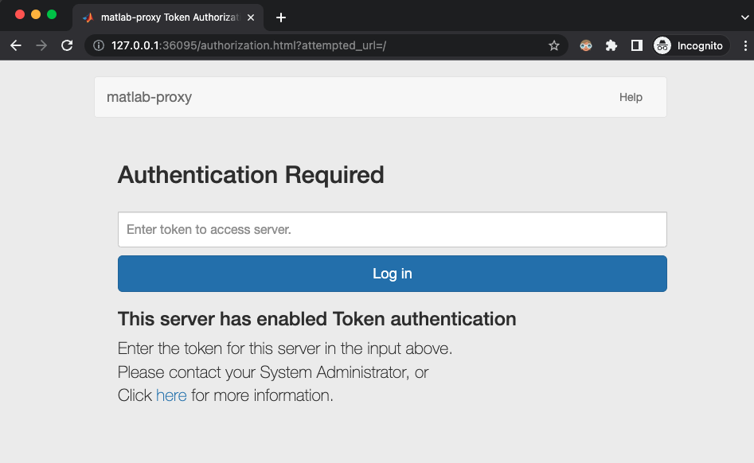
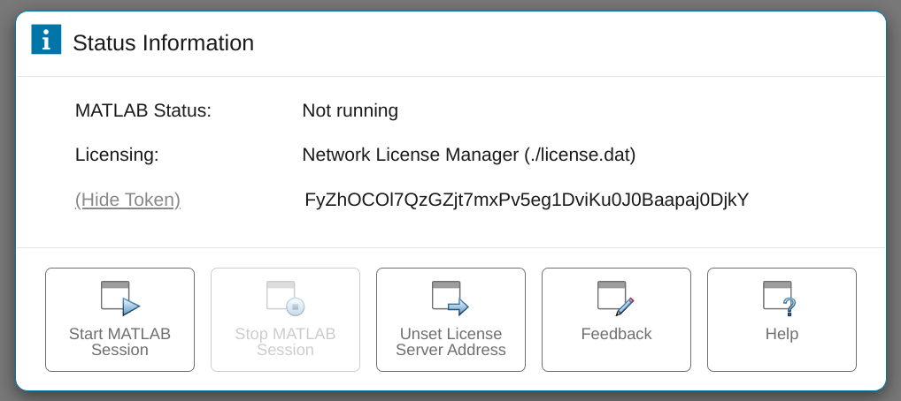

# Security

**Table of Contents:**
- [Reporting Security Vulnerabilities](#reporting-security-vulnerabilities)
- [Security Features](#security-features)
- [**SSL Support**](#ssl-support)
- [**Token-Based Authentication**](#token-based-authentication)
  - [**Use with auto-generated tokens**](#use-with-auto-generated-tokens)
  - [**Specify your own token**](#specify-your-own-token)
  - [**Use Token Authentication with SSL enabled**](#use-token-authentication-with-ssl-enabled)
  - [**Token Recovery**](#token-recovery)
    - [**Recover tokens from the machine**](#recover-tokens-from-the-machine)
    - [**Recover token from a previously authenticated browser session**](#recover-token-from-a-previously-authenticated-browser-session)
- [Security Best Practices](#security-best-practices)

## Reporting Security Vulnerabilities
If you believe you have discovered a security vulnerability, please report it to
security@mathworks.com instead of GitHub. Please see
[MathWorks Vulnerability Disclosure Policy for Security Researchers](https://www.mathworks.com/company/aboutus/policies_statements/vulnerability-disclosure-policy.html)
for additional information.

----

## Security Features
The following features are available in `matlab-proxy` to provide secure access to MATLAB:
  - [SSL Support](#ssl-support)
  - [Token-Based Authentication](#token-based-authentication)

----

## **SSL Support**
Configure `matlab-proxy` to use SSL by providing the desired SSL certificates using the following environment variables at server launch:
The following environment variables must be set to enable `matlab-proxy` to run on SSL:
1. *MWI_SSL_CERT_FILE*
   
    A string with the full path to a single file in PEM format containing the certificate as well as any number of CA certificates needed to establish the certificate’s authenticity.

2. *MWI_SSL_KEY_FILE*
   
   A string with the full path to a file containing the private key. If absent, the private key must be present in the certfile provided with *MWI_SSL_CERT_FILE*.

Example:
```bash
# Launch matlab-proxy with SSL enabled
$ env MWI_SSL_CERT_FILE="/path/to/certificate.pem" MWI_SSL_KEY_FILE="/path/to/keyfile.key" matlab-proxy-app

# The access link is presented in the terminal upon startup like follows:
==================================================================================================
                                  MATLAB can be accessed at:                              
                                    https://127.0.0.1:37109   
==================================================================================================

# NOTE: The server is running HTTP(S) ! 

```

----

## **Token-Based Authentication**

`matlab-proxy` is a web server and that allows one to launch and access MATLAB on the machine the server is running on.
By default anyone with access to the server can access MATLAB and thereby the machine on which its running.

When `Token-Based Authentication` is enabled, the server will require a token to authenticate access.
This token can be provided to the server in 2 ways:

1. Through the [URL parameter](https://www.rfc-editor.org/rfc/rfc3986#section-3.4) : `mwi_auth_token`. Example:
    ```html
    https://localhost:8888/?mwi_auth_token=abcdef...
    ```
    Once provided, this information is cached in the browser and will be used in subsequent interactions

2. Through the auth token input field in the Status Information dialogue box that is presented when the user is not already logged in.
    <p align="center">
      
    </p>

3. Through a `mwi_auth_token` header. Example:
    ``` html
    mwi_auth_token:abcdef..
    ```

**NOTE** : Its highly recommended to use this feature along with SSL enabled as shown [here](#use-token-authentication-with-ssl-enabled).

### **Use with auto-generated tokens**

Enable `Token-Based Authentication` by setting the environment variable `MWI_ENABLE_TOKEN_AUTH` to `True` on server launch.

When enabled, `matlab-proxy` will require the URL to specify the access token using the [query component](https://www.rfc-editor.org/rfc/rfc3986#section-3.4) `mwi_auth_token`.

Example:

```bash

# Launch matlab-proxy with Token-Based Authentication enabled
$ env MWI_ENABLE_TOKEN_AUTH=True matlab-proxy-app

# The access link is presented in the terminal upon startup like follows:
==================================================================================================
                                  MATLAB can be accessed at:                              
    http://127.0.0.1:37109?mwi_auth_token=SY78vUw5qyf0JTJzGK4mKJlk_exkzL_SMFJyilbGtNI   
==================================================================================================
```
In this example `SY78vUw5qyf0JTJzGK4mKJlk_exkzL_SMFJyilbGtNI` is the token that the server would need for all future communication.

After initial access, this token is cached by the browser, and all subsequent access from the same browser to the server will not require this token.
You will however need this token to access the server from a new browser session or if you have cleared cookies or have cookies disabled.

### **Specify your own token**

*Optionally*, you can also specify your own secret token using the environment variable `MWI_AUTH_TOKEN`.
Ensure that your custom token is url safe. 
A token can safely contain any combination of alpha numeric text along with the following permitted characters: `- .  _  ~`

See [URI Specification RFC3986](https://www.ietf.org/rfc/rfc3986.txt) for more information on URL safe characters.

Example:
```bash

# Launch matlab-proxy with Token-Based Authentication enabled, and with custom token with a value of "MyCustomSecretToken"
$ env MWI_ENABLE_TOKEN_AUTH=True MWI_AUTH_TOKEN=MyCustomSecretToken matlab-proxy-app

# The access link is presented in the terminal upon startup like follows:
==================================================================================================
                                  MATLAB can be accessed at:                              
                http://127.0.0.1:37109?mwi_auth_token=MyCustomSecretToken   
==================================================================================================
```

### **Use Token Authentication with SSL enabled**

It is recommended to enable both `Token-Based Authentication` and `SSL` to secure your access to MATLAB via matlab-proxy. As an example, the following command enables access to MATLAB using HTTPS and token-based authentication

For example, the following command launches the server to deliver content on `HTTPS` along with Token-Based Authentication enabled:
```bash
# Launch matlab-proxy with Token-Based Authentication & SSL enabled with custom token with a value of "asdf"
$ env MWI_SSL_CERT_FILE="/path/to/certificate.pem" MWI_SSL_KEY_FILE="/path/to/keyfile.key" MWI_ENABLE_TOKEN_AUTH=True MWI_AUTH_TOKEN=asdf matlab-proxy-app

# The access link is presented in the terminal upon startup like follows:
==================================================================================================
                                  MATLAB can be accessed at:                              
                        https://127.0.0.1:37109?mwi_auth_token=asdf   
==================================================================================================

# NOTE: This server is running HTTP(S) ! 

```

### **Token Recovery**

To recover tokens for a previously launched server, you will need access to either:

1. The machine on which the server was launched, while being logged in as the user that launched the server.
2. An authenticated browser session launched for the same user.

#### **Recover tokens from the machine**

1. Login to the machine on which the servers are running, as the user that launched matlab-proxy.
1. Activate the python environment from which the server was launched.
    * This should be the same environment from which the server was launched.
    * Run the executable `matlab-proxy-app-list-servers`

Example:
```bash

# Connect to the machine on which the server was started:
$ ssh test-user@usermachine 

# Running this command should print all running servers!
(usermachine) $ matlab-proxy-app-list-servers

-------------------------------------------------------------------------------------------------------------------
                                             Your running servers are:                                             
-------------------------------------------------------------------------------------------------------------------
1.  https://127.0.0.1:46525/asdf?mwi_auth_token=asdfasdf
2.  http://127.0.0.1:39057/test?mwi_auth_token=_qNJIXEbnXwrj9nxZwbJiWno0YqYSh8BMdQOR6K67y0
3.  http://127.0.0.1:35647/test?mwi_auth_token=r6djdrcf591PttYlDZcVL78xIa1XgCviM9dQD-BrqDE
4.  http://127.0.0.1:36537/test?mwi_auth_token=HdQ-9tooAzA0A0CrpUxP1e5crQBErMQC3tPGTkTtrVo
5.  http://127.0.0.1:35433/test
-------------------------------------------------------------------------------------------------------------------
                                                     Thank you.                                                    
-------------------------------------------------------------------------------------------------------------------
```

For servers for which `Token-Based Authentication` were enabled, the URLs above will include their tokens.
You can use them to gain access to your server as described in the [Introduction](#introduction).

#### **Retrieve token from a previously authenticated browser session**

1. Click on the `View Token` link to see the token
    <p align="center">
      
    </p>

2. Click on the `Hide Token` link to hide the token 
    <p align="center">
      
    </p>

## Security Best Practices

* Never share access to your server
  Never share URLs from `matlab-proxy` with others. Doing so is equivalent to sharing your user account.
  
* System administrators who launch `matlab-proxy` for other users, must launch the proxy as the user for whom the server is intended.

----

Copyright 2020-2023 The MathWorks, Inc.

----
