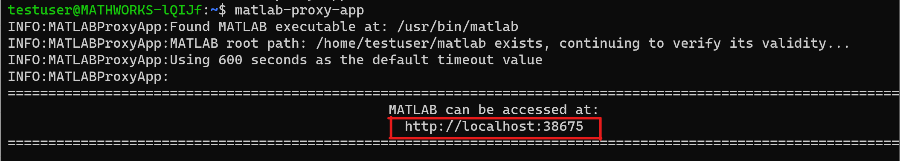
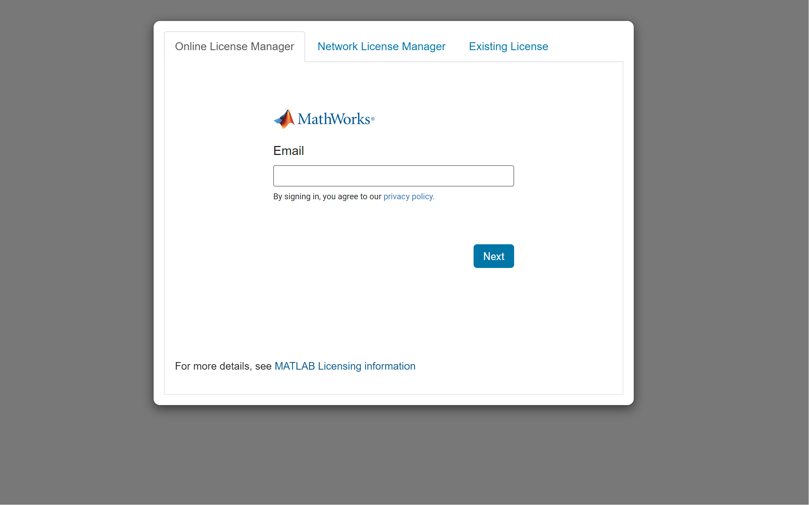

# WSL 2 Installation Guide for matlab-proxy


Windows® Subsystem for Linux® (WSL 2), available in Windows 10 and later, allows users to run Linux binaries in Windows. This repository shows how to install and start `matlab-proxy` in WSL 2.

---

**Table of Contents**
- [Requirements](#requirements)
- [Set up WSL 2](#set-up-wsl-2)
	- [Install WSL 2](#install-wsl-2)
	- [Set up Linux Distribution](#set-up-linux-distribution)
	- [Install System Dependencies](#install-system-dependencies)
- [Set up MATLAB](#set-up-matlab)
	- [Install MATLAB](#install-matlab)
	- [Add MATLAB executable path to system PATH](#add-matlab-executable-path-to-system-path)
- [Install matlab-proxy](#install-matlab-proxy)
- [Start matlab-proxy](#start-matlab-proxy)
- [Configure a Python Virtual Environment](#configure-a-python-virtual-environment)

## Requirements

To use WSL 2, you need one of the following:

- Windows 10

    - For x64 systems: Version 1903 or later, with Build 18362.1049 or later.
    - For ARM64 systems: Version 2004 or later, with Build 19041 or later.

- Windows 11.

To check your Windows version, run the following command in `command prompt`:

```bash
winver
```

## Set up WSL 2

### Install WSL 2

Set up WSL 2 on your Windows machine:

1. From the Start menu, click **Turn Windows features on or off**.
	
    <p align="left">
    
    </p>

2. Enable the following options:
	- Virtual Machine Platform
	- Windows Subsystem for Linux

    Restart the system if prompted.

	This activates WSL and the system's virtualization capability, which is required to run WSL 2.
    
	<p align="left">
    
    </p>
	
3. Install the WSL 2 Linux Package. Open `command prompt` and run the following command:    

    ```bash
    wsl.exe --update
    ```

For details, see [Install WSL](https://learn.microsoft.com/en-us/windows/wsl/install-manual)(Microsoft).

### Set up Linux Distribution


1. Install your Linux distribution, such as Debian or Ubuntu, from the Microsoft Store. MathWorks recommends [Ubuntu 22.04](https://www.microsoft.com/store/productId/9PN20MSR04DW?ocid=pdpshare) or run the following command:

    ```bash
    wsl.exe --install Ubuntu-22.04
    ```

2. To start the Linux distribution, select it from the Start menu. Use the prompt to set a new username and password.
	
    <p align="left">
    
    </p>

3. Check that the Linux version is `2`. Open a new `command prompt` and run the following command:
	
    ```bash
	wsl -l -v
	```
	
    If necessary, set the Linux version to `2` using
		
    ```bash
    wsl --set-version <distro name> 2
    ``` 
	
    For example:

    ```bash
    wsl --set-version Ubuntu 2
    ```

    <p align="left">
    
    </p>
	

### Install System Dependencies

Install the system packages required to install and run MATLAB®.

1. Start the `Linux Distro (Ubuntu 22.04)` and update the package lists.

	```bash
	sudo apt update
	```

2. Install `xvfb`, used to display plots and figures.

	```bash
	sudo apt install xvfb -y
	```

    For `xvfb` to work correctly, remount `/tmp/.X11-unix` with read-write permission:

    ```bash
    sudo mount -o remount,rw /tmp/.X11-unix
    # Adding it to the .bashrc file
    echo `sudo mount -o remount,rw /tmp/.X11-unix` >> ~/.bashrc
    ```

3. Install Python.

	```bash
	sudo apt install python-is-python3 python3-pip wget unzip ca-certificates -y
	```

4. Install [MATLAB Package Manager](https://github.com/mathworks-ref-arch/matlab-dockerfile/blob/main/MPM.md).

	```bash
	wget https://www.mathworks.com/mpm/glnxa64/mpm 
    chmod +x mpm
	```

## Set up MATLAB

### Install MATLAB


1. Use MPM to install MATLAB. For example, to install MATLAB R2023a, navigate to the folder containing the `mpm` binary file and run this command:

	```bash
	./mpm install --release=R2023a --destination=/home/<username>/matlab --products MATLAB 
	```

    <p align="left">
    
    </p>

    For more information on using MPM to install MATLAB, see [MATLAB Package Manager](https://github.com/mathworks-ref-arch/matlab-dockerfile/blob/main/MPM.md).

2. Install the system dependencies that MATLAB requires. To see these dependencies, listed by MATLAB release & OS, refer to `base-dependencies.txt` in the corresponding [MATLAB Dependencies](https://github.com/mathworks-ref-arch/container-images/tree/main/matlab-deps) folder.

	For example, to install the dependencies for MATLAB R2023a on Ubuntu 22.04:
    
    1. Navigate to `2023a` -> `Ubuntu22.04` -> `base-dependencies.txt`.
    2. Download the base-dependencies file.

        ```bash
        wget https://raw.githubusercontent.com/mathworks-ref-arch/container-images/main/matlab-deps/r2023a/ubuntu22.04/base-dependencies.txt
        ```

    3.  Install the dependencies.

        ```bash
        cat base-dependencies.txt | xargs sudo apt install -y
        ```

### Add MATLAB executable path to system PATH


`matlab-proxy` expects the `matlab` executable to be present on the system PATH and will throw an error if it is unable to find the executable.

1. To make the `matlab` executable available on system PATH use the command:

	```bash
	sudo ln -fs <MATLAB_ROOT>/bin/matlab /usr/bin/matlab
	```
    
	where `MATLAB_ROOT` points to the folder in which MATLAB was installed. For example, the default value of `MATLAB_ROOT` in WSL 2 is `/home/<username>/matlab`.

	Alternatively, you can update the system PATH to include the path to MATLAB binaries by executing the following command in your terminal.

	```bash
	export PATH=$PATH:/home/<username>/matlab/bin
	```
	`/home/<username>/matlab/` is the path where the MATLAB is installed.

2. Execute the following command to show the current MATLAB path.
	
    ```bash
	which matlab
	```

    <p align="left">
        
    </p>

## Install matlab-proxy

1. Install `matlab-proxy`.

    ```bash
    python -m pip install matlab-proxy
    ```
    Note: in newer versions of Linux, such as Debian 12 or higher, you are unable to install python packages in `externally-managed-environment`. To use a virtual environment instead, follow the steps in [Configure a Python Virtual Environment](#configure-a-python-virtual-environment).
    


2. Installing the package creates an executable called `matlab-proxy-app`, which `pip` usually places on the PATH: `$HOME/.local/bin`. 

    Add this to the system path:

    ```bash
	export PATH=$PATH:/home/<username>/.local/bin
	```

    To confirm the executable is on the PATH, run the command:

    ```bash
    which matlab-proxy-app
    ```

    ```bash
    /home/<username>/.local/bin/matlab-proxy-app
    ```

## Start matlab-proxy

1. To start `matlab-proxy`, run the command:

    ```bash
    matlab-proxy-app
    ```
    <p align="left">
        
    </p>

2. Open the highlighted link in your web browser and enter the licensing information.

    <p align="left">
        
    </p>

3. Run a simple `peaks` command:

    <p align="left">
        
    </p>


To build `matlab-proxy` from its source code, see the [Installation](https://github.com/mathworks/matlab-proxy#installation) section of `matlab-proxy`. For more information on using `matlab-proxy`, see [Usage](https://github.com/mathworks/matlab-proxy#usage).


## Configure a Python Virtual Environment

This guide shows how to install the `matlab-proxy` package in a Python Virtual Environment. 

Two commonly used environments are:
1. Python venv
2. conda

This guide uses conda as the environment manager.

1. Install [miniconda](https://docs.conda.io/projects/miniconda/en/latest/).

2. Create a new python environment called `r2023a` by executing the command:

    ```bash
    conda create -n r2023a python=3.11 -y
    ```

3. Activate the conda environment `r2023a` by executing the command:

    ```bash
    conda activate r2023a
    ```

4. To install `matlab-proxy` execute:

    ```bash
    python -m pip install matlab-proxy
    ```

5. Reactivate the conda environment.

    ```bash
    conda activate r2023a
    ```

6. Verify that `matlab-proxy` is running from the conda virtual environment.

    ```bash
    which matlab-proxy-app
    ```

    ```bash
    /home/<username>/miniconda3/envs/r2023a/bin/matlab-proxy-app
    ```

    If you see the path listed as `/home/<username>/.local/bin/matlab-proxy-app`, first uninstall the local version, then reinstall `matlab-proxy` in the conda virtual environment.

7. Follow the steps in [Start matlab-proxy](#start-matlab-proxy).


---

Copyright 2024 The MathWorks, Inc.

---
